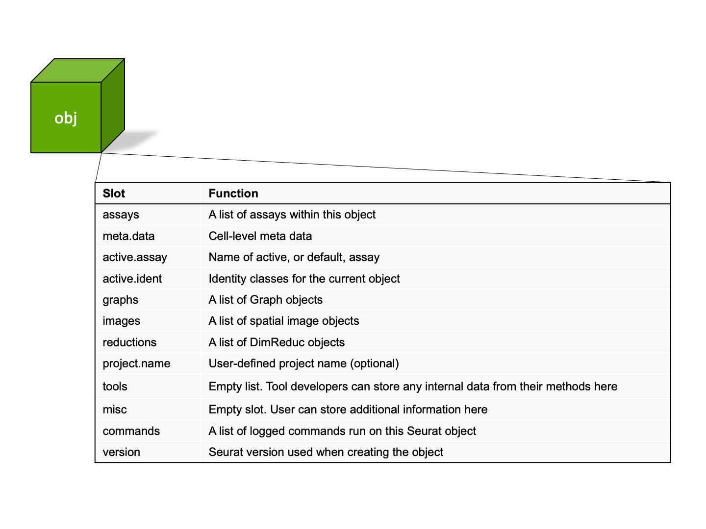
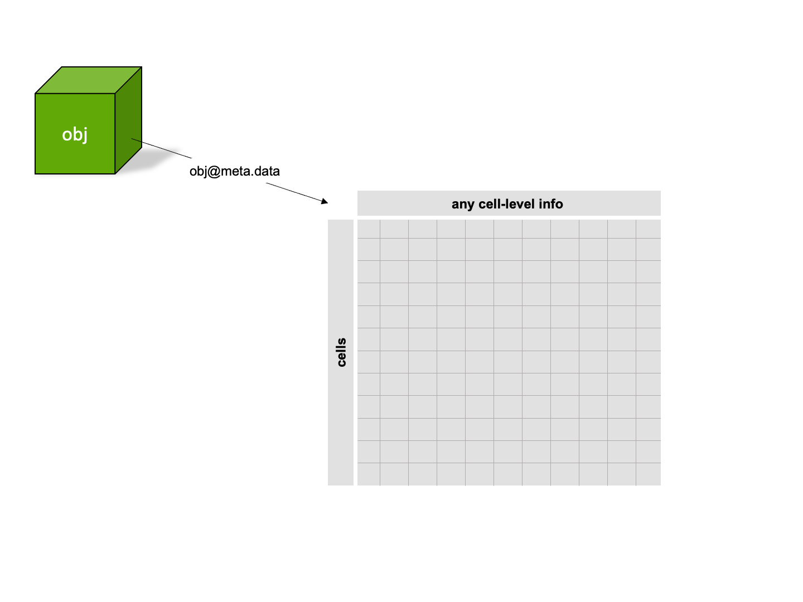
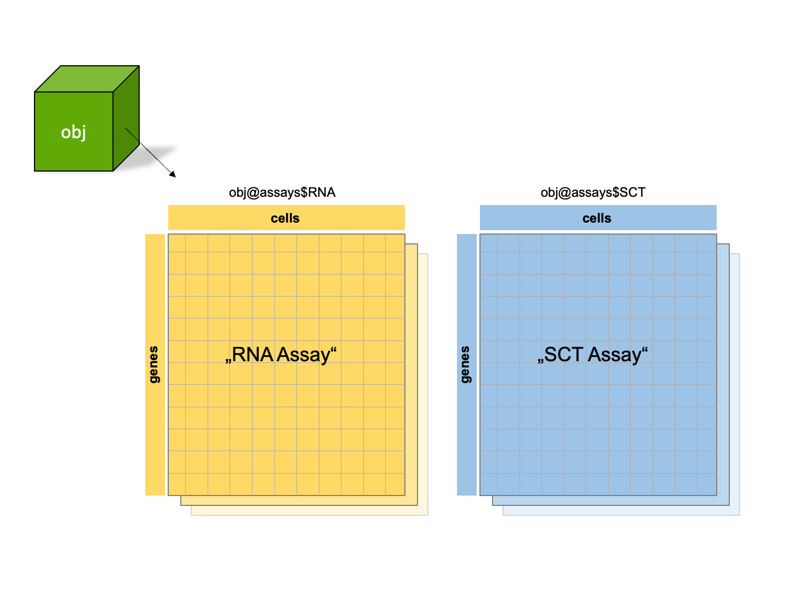
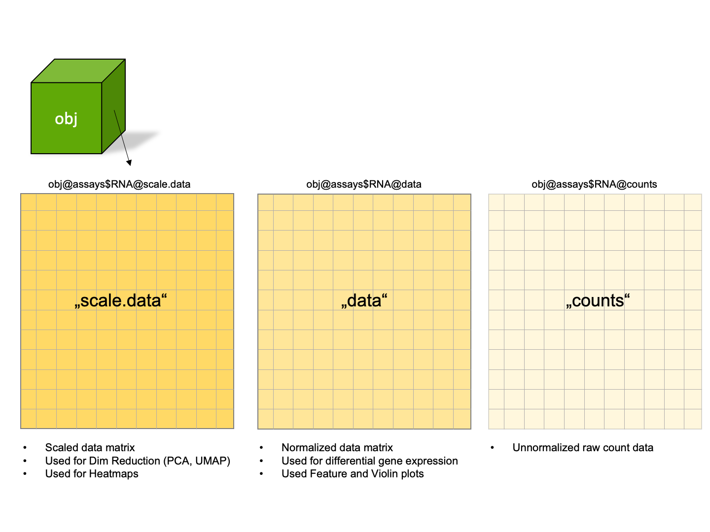
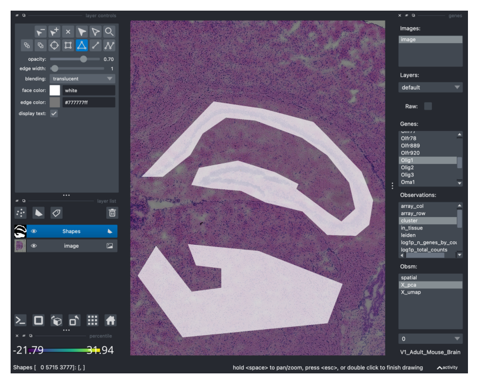

## Prompt

*Describe an R package that you use regularly. What are the most useful class/methods/functions? What are the limitations, gotchas, bugs in the package? Can you white-board a strategy that might work to improve the package? We are interested in how well you know your tools and how interested you are in improving stuff you use.*

*Submit your notes, code blocks, explanation/demo as a markdown file or RStudio/RMarkdown to a public github repo and submit the url for review.*

## Description

### Overview

The R package I use most frequently is [Seurat](https://satijalab.org/seurat/). Seurat is a toolkit for single-cell genomics analysis developed by Rahul Satija's lab at the New York Genome Center and one of the most popular analysis packages due its excellent documentation and thorough vignettes. It also has the added benefit of being based in R, which many biologists and statisticians are familiar with. There are of course, other powerful and popular analysis packages/workflows such as:

-   [scverse](https://scverse.org/)

-   [Bioconductor](https://bioconductor.org/books/release/OSCA/)

I believe Seurat is a popular option for single-cell analysis, not only because of the informative vignettes, but because the development team are considerate of the way that [most]{.underline} people, not only experts, will interact with and use their package. In this way, I see Seurat as having the lowest barrier of entry, and one of the best places for beginners to start their journey with single-cell analysis. Their github issues page is actually a welcoming place, where many questions are answered not only about the inter workings of the library, but also about experimental design and best practices, [e.g. #2461](https://github.com/satijalab/seurat/issues/2461), currently they have over 5500 closed issues.

Seurat also offers a number of built-in features such as, [multi-modal data analysis](https://satijalab.org/seurat/articles/multimodal_vignette.html), and the ability to analyze [spatial data sets](https://satijalab.org/seurat/articles/spatial_vignette.html) from 10x Visium and Slide-seq formats. They also have excellent options for [integration](https://satijalab.org/seurat/articles/integration_introduction.html), including the ability to integrate data from different modalities, and to annotate query data with pre-annotated references, aka "reference mapping".

### Loading Seurat and example data

```{r, warning=F, message=F}
library(Seurat)
library(SeuratData)
library(SeuratDisk)
library(tidyverse)
library(knitr)
library(scater)
library(reticulate)
library(ggrepel)
InstallData("pbmc3k")
data("pbmc3k")
pbmc3k
```

### Seurat Class

#### Object structure

The Seurat object is at the heart of the package, it contains all the necessary representations of the expression data as well as cell-level and feature-level metadata.

```{r, echo=F, out.width='70%', out.height='70%', fig.align='center'}

```

#### Metadata

The meta.data slot contains cell-level data, such as the total counts (nCounts) and unique features for each cell (nFeatures). It is also an convenient place to store new information, such as cluster annotations or gene signature scores.

```{r, echo=F, out.width='70%', out.height='70%', fig.align='center'}

```

```{r}
head(ifnb@meta.data)
```

#### Assays

Assays are individual representations of the expression data and are organized as (feature x observation) matrices (e.g. genes x cells). For example, the "RNA assay" is the default assay after object creation and will contain the raw count matrix. If sctransform normalization is performed on a data set, a new assay is created, the "SCT assay". Similarly if integration is performed, an "Integrated assay" is created.

```{r, echo=F, out.width='70%', out.height='70%', fig.align='center'}

```

#### Assay slots

Within each assay, transformations of the data exist as "slots". It's important to note, that based on your workflow (traditional normalization v. sctransform normalization) these slots will be different types transformations (i.e. uncorrected v. corrected).

-   `scale.data` slot is a scaled matrix used for dimensional reduction and heatmaps.

-   `data` slot is normalized data used for differential gene expression, marker ID, etc.

-   `counts` slot is unnormalized raw count data.

```{r, echo=F, out.width='70%', out.height='70%', fig.align='center'}

```

### Basic workflow

The basic Seurat workflow based on their popular [vignette](https://satijalab.org/seurat/articles/pbmc3k_tutorial.html).

```{r, message=F, warning=F, results='hide', fig.align='center'}
# Calculate the % of mitrochondrial reads/cell, store this in the metadata
pbmc3k[["percent.mt"]] <- PercentageFeatureSet(pbmc3k, pattern = "^MT-")

# Filter out low-quality cells
pbmc3k <- subset(pbmc3k, subset = nFeature_RNA > 200 &
                 nFeature_RNA < 2500 & percent.mt < 5)

# Log-normalize, identify highly variable genes, scale and run PCA
pbmc3k <- pbmc3k %>%  NormalizeData() %>% FindVariableFeatures() %>%
  ScaleData() %>% RunPCA()

# Run clustering (graph-based with louvain algorithm)
pbmc3k <- FindNeighbors(pbmc3k, dims = 1:10)
pbmc3k <- FindClusters(pbmc3k, resolution = 0.5)

# Run Non-linear dimensionality reduction
pbmc3k <- RunUMAP(pbmc3k, dims = 1:10)

# Plot
DimPlot(pbmc3k, label = T)
```

## Useful features

### Options for integration

In our research, we use scRNA-seq as a comparative method to explore differences in cell populations between wild-type and genetically modified mice. Therefore data integration is essential to ensure we are comparing shared cell populations across conditions, as well as removing unwanted batch effects.

Often, in our experimental framework, the difference between conditions (e.g. WT v. KO) isn't very dramatic. So, we need workflows that allow us to retain biological heterogeneity across conditions, without overly-integrating the data and potentially hiding important differences. This of course puts a more weight on the importance of validating our findings with other methods, but we are happy to do this. Luckily, Seurat provides multiple methods for data integration, that can be applied based on the experimental design or magnitude of response between control and experimental groups.

The Seurat developers make an important note that their default integration workflow based on canonical correlation analysis (CCA), may in some cases lead to over-correction, pulling together cell states across conditions that shouldn't be aligned. Their alternative, reciprocal PCA (RPCA) based integration, is a more conservative method and is less likely to align cells in different biological states. In this method, each data set is projected into each others PCA space, and the anchors are then constrained by the same mutual neighborhood requirement. When designating a reference dataset, the comparisons are then limited to just the reference vs query and anchors are not identified between pairs of query datasets, yielding similar results with less compute time. The reference-based RPCA approach is well suited to our work.

Using the built in `ifnb` data set, which consists of control and interferon-stimulated PBMC, the following is a rudimentary comparison of workflows to highlight the difference in computational time and integration "strength" between simple merging, CCA integration and reference-based RPCA integration. Here we only have one control and one query dataset for integration, but if we had replicates of each treatment, reference-based RPCA would save even more time.

```{r, echo=F}
# Increase the default limit of global variables, as discussed: https://satijalab .org/seurat/articles/future_vignette.html
options(future.globals.maxSize = 2000 * 1024^2)
```

```{r, warning=F, message=F, results='hide'}
# Install ifnb data with the SeuratData package
InstallData("ifnb")

# Merge based workflow
data("ifnb")
merge_start <- Sys.time()
ifnb.list <- SplitObject(ifnb, split.by = "stim")
ifnb.list <- lapply(X = ifnb.list, FUN = SCTransform)
variable_genes <- SelectIntegrationFeatures(object.list = ifnb.list)
ifnb <- merge(x = ifnb.list[[1]], y = ifnb.list[[2]])
VariableFeatures(ifnb) <- variable_genes
ifnb <- RunPCA(ifnb, npcs = 50)
ifnb <- RunUMAP(ifnb, reduction = "pca", dims = 1:25)
ifnb <- FindNeighbors(ifnb, dims = 1:25)
ifnb <- FindClusters(ifnb, resolution = 0.4)
merge_end <- Sys.time()
p1 <- DimPlot(ifnb, group.by = "stim") + labs(subtitle = "Merged") +
  theme(plot.title = element_blank(), legend.position = "none")

# CCA integration workflow
data("ifnb")
cca_start <- Sys.time()
ifnb.list <- SplitObject(ifnb, split.by = "stim")
ifnb.list <- lapply(X = ifnb.list, FUN = SCTransform)
features <- SelectIntegrationFeatures(object.list = ifnb.list)
ifnb.list <- PrepSCTIntegration(object.list = ifnb.list,
                                anchor.features = features)
anchors <- FindIntegrationAnchors(object.list = ifnb.list,
                                  normalization.method = "SCT",
                                  anchor.features = features,
                                  dims = 1:25)
ifnb <- IntegrateData(anchorset = anchors, normalization.method = "SCT")
ifnb <- RunPCA(ifnb, npcs = 50)
ifnb <- RunUMAP(ifnb, reduction = "pca", dims = 1:25)
ifnb <- FindNeighbors(ifnb, dims = 1:25)
ifnb <- FindClusters(ifnb, resolution = 0.4)
cca_end <- Sys.time()
p2 <- DimPlot(ifnb, group.by = "stim") + labs(subtitle = "CCA") +
  theme(plot.title = element_blank(), legend.position = "none")

# Reference-based RPCA integration workflow
data("ifnb")
rpca_start <- Sys.time()
ifnb.list <- SplitObject(ifnb, split.by = "stim")
ifnb.list <- lapply(X = ifnb.list, FUN = SCTransform)
features <- SelectIntegrationFeatures(object.list = ifnb.list)
ifnb.list <- PrepSCTIntegration(object.list = ifnb.list, anchor.features = features)
ifnb.list <- lapply(X = ifnb.list, FUN = RunPCA, features = features)
anchors <- FindIntegrationAnchors(object.list = ifnb.list,
                                  normalization.method = "SCT",
                                  reference = 1, # index of control obj in ifnb.list
                                  anchor.features = features,
                                  dims = 1:25,
                                  reduction = "rpca",
                                  k.anchor = 5)
ifnb <- IntegrateData(anchorset = anchors,
                      normalization.method = "SCT",
                      dims = 1:25)
ifnb <- RunPCA(ifnb, npcs = 50)
ifnb <- RunUMAP(ifnb, reduction = "pca", dims = 1:25)
ifnb <- FindNeighbors(ifnb, dims = 1:25)
ifnb <- FindClusters(ifnb, resolution = 0.4)
rpca_end <- Sys.time()
p3 <- DimPlot(ifnb, group.by = "stim") + labs(subtitle = "Reference-based RPCA") +
  theme(plot.title = element_blank())
```

```{r, out.height='50%', out.width='100%'}
# Compute time comparison
df <- data.frame(method=c("Merged", "CCA", "RPCA"),
           compute_time= c(merge_end-merge_start,
                           cca_end-cca_start,
                           rpca_end-rpca_start))
print(df)

# Integration comparison
p1 + p2 + p3 
```

### Scoring gene programs

`AddModuleScore()` is a very useful function to calculate the average expression for a list of genes, this is great for showing gene programs across clusters.

```{r, warning=F, message=F, out.height='50%', out.width='100%'}
# Log normalize and scale the RNA assay
DefaultAssay(ifnb) <- "RNA"
ifnb <- ifnb %>% NormalizeData() %>% ScaleData()

# Read in "response to interferon" gene ontology term; biological processes
gene_list <- read_csv(file = "data/gene_signatures.csv")
interferon <- gene_list$GO.0034340_response_to_type_I_interferon

# Genes have to be in list format
interferon <- interferon %>% na.omit() %>% unique() %>% list()

# Calculate the gene module score for each cell, this is stored in the metadata
ifnb <- AddModuleScore(ifnb, features = interferon, ctrl = 20, name = "interferon")
head(ifnb@meta.data)

# Visualize the module score expression 
FeaturePlot(ifnb, features = "interferon1", split.by = "stim")
```

### Sub-setting

`subset()` makes it easy to do sub analysis of certain clusters, or cells based on expression levels. You can subset on any feature in the dataset. Although this isn't a Seurat function, it works seamlessly with the Seurat objects, which saves a lot of time.

```{r, out.height='50%', out.width='100%'}
# Subset cluster 0
ifnb_sub <- subset(ifnb, idents = "0")

# Plot the full object, and subset
p1 <- DimPlot(ifnb, label = T)
p2 <- DimPlot(ifnb_sub, label = T)
p1 + p2
```

```{r, out.height='100%', out.width='100%', fig.align='center', results=F}
# Subset cells that express Versican (VCAN), a hyaluronan-binding proteoglycan
ifnb_vcan <- subset(ifnb, subset = VCAN > 1)
p1 <- FeaturePlot(ifnb, features = "VCAN")
p2 <- FeaturePlot(ifnb_vcan, features = "VCAN")
p1 + p2
```

### Customizing plots

`LabelClusters()` is a useful function to customize DimPlot labeling, this makes it easy to design graphs that have better interpretability. I find it nice that the developers included several plotting functions like this, because it can be hard to find the important data inside the Seurat object for plotting using ggplot2 alone.

```{r, out.height='70%', out.width='100%'}
# Create a basic UMAP plot, of the pre-annotated clusters
p <- DimPlot(ifnb,
             reduction = "umap",
             pt.size = .3,
             label = F,
             group.by = "seurat_annotations") +
  xlab("UMAP-1") +
  ylab("UMAP-2") +
  labs(color = "Identity") +
  theme(legend.text = element_text(size = 11),
        legend.title = element_text(size = 15),
        legend.justification = "top",
        legend.key.size = unit(3, "point"),
        axis.text.x = element_blank(),
        axis.text.y = element_blank(),
        axis.title = element_text(size = 16),
        plot.title = element_blank()) +
  guides(color = guide_legend(override.aes = list(size = 4.25),
                              nrow = 20))

# Use LabelClusters to customize the appearance of the annotation labels
LabelClusters(plot = p,
              id = "seurat_annotations",
              repel = T,
              force = 0.25,
              box = T,
              fill = alpha("white", 0.45),
              size = 4,
              label.r = unit(0.25, "lines"),
              label.size = NA)
```

### Conserved markers

`FindConservedMarkers()` is also a very useful function when you have multiple conditions and you would like to find the conserved marker genes in each cluster. For our purposes, this is a useful sanity check that the cluster identities are in fact shared biological states between groups.

Below I find conserved markers in the `ifnb` dataset, between the control and stimulated PBMC samples, within in the pre-annotated natural killer cell cluster (NK).

```{r, warning=F, message=F, fig.align='center'}
# Set Idents to the annotation that comes with the ifnb data set "seurat_annotations"
Idents(ifnb) <- "seurat_annotations"

# Find conserved markers of NK identity versus all other cells in both conditions
NK_markers <- FindConservedMarkers(object = ifnb,
                                   ident.1 = "NK",
                                   grouping.var = "stim")
head(NK_markers)

# Plot
FeaturePlot(ifnb, features = "GNLY", split.by = "stim")
```

### Object conversion

Seurat also has useful functions to convert back and forth between popular single-cell object classes. `as.SingleCellExperiment()` and `as.Seurat()` allow you to convert back and forth between Seurat objects and SingleCellExperiment objects which are used in many Bioconductor packages like [scater](https://bioconductor.org/packages/release/bioc/html/scater.html) or [miloR](https://bioconductor.org/packages/release/bioc/html/miloR.html).

```{r}
# Convert the ifnb Seurat object to SingleCellExperiment object
ifnb_sce <- as.SingleCellExperiment(ifnb, assay = "RNA")
ifnb_sce
```

```{r}
# Convert back to Seurat object
ifnb_seurat <- as.Seurat(ifnb_sce)
ifnb_seurat
```

Using the `SeuratDisk` library, you can also convert to the AnnData format to use in [scanpy](https://scanpy.readthedocs.io/en/stable/). This is also a bit of a "gotcha" because you have to load an associated library to make this happen. It would be nicer to have this as a built-in feature of Seurat itself.

```{r, warning=F, message=F, results='hide'}
# Save ifnb Seurat object as h5 and covert to AnnData
SaveH5Seurat(ifnb, filename = "results/objects/ifnb.h5Seurat", overwrite = T)
Convert("results/objects/ifnb.h5Seurat", dest = "h5ad", overwrite = T)
```

```{python}
# import scanpy library
import scanpy

# Read in the converted Seurat object as AnnData
adata = scanpy.read_h5ad("results/objects/ifnb.h5ad")
adata
```

## Limitations

### Scale and ML integration

The major criticism of Seurat is that it will not be able to scale effectively to large data sets. This is a legitimate problem, as throughput increases and cost decreases for single-cell experiments. Also, when considering the utility of applying single-cell to large-scale drug discovery efforts or the human cell atlas, speed and scale will be essential to processing large datasets. So at a production level, Seurat may have serious limitations.

As the developers of scanpy pointed out, Seurat is somewhere between 5-90x slower than their python package [Wolf et al. 2018](https://genomebiology.biomedcentral.com/articles/10.1186/s13059-017-1382-0). Moreover, analysis of single-cell data in python has the added benefit of being able to directly interface with popular and well developed machine learning toolsets such as TensorFlow and Scikit-Learn.

## Gotchas & Bugs

### Transposed expression matrix

The expression matrices are transposed compared to AnnData. Seurat uses [genes x cells], AnnData use [cells x genes]. This is taken care of by the conversion functions, but annoying nonetheless.

```{r}
dim(ifnb_seurat)
```

```{python}
adata.shape
```

### Module score naming

`Addmodulescore()` adds a "1" to the input `name` argument when it's saved in the metadata. This is annoying because it prevents you from easily looping through a set of genes and simultaneously plotting them using the same input name. This is likely a safety measure that prevents metadata from being overwritten, but is unnecessary, and should be more straight forward to allow easier plotting.

```{r, warning=F, message=F, out.height='70%', out.width='100%'}
# Read in GO term gene lists
gene_list <- read_csv(file = "data/gene_signatures.csv")

# Loop through each column, adding a module score for each GO term
for (i in colnames(gene_list)) {
  print(paste0("Scoring: ", colnames(gene_list[i])))
  genes <- gene_list %>% pull(i) %>% na.omit() %>% unique() %>% list()
  ifnb <- AddModuleScore(ifnb,
                         features = genes,
                         name = i,
                         assay = "RNA",
                         crtl = 20)
  }
head(ifnb@meta.data)
FeaturePlot(ifnb, features="GO.0045655_regulation_of_monocyte_differentiation1")
```

### SpatialFeaturePlot() scaling

Another annoying bug I have come across is trying to plot features on multiple slices of spatial resolved data. Using `SpatialFeaturePlot()` on a spatial object with more than one slice does not display the feature expression on the same scale for each slice. This is makes comparisons between the slices impossible.

Below is a demonstration of this with a 10x Visium data set from our lab. It consists of cardiac tissue 24 h after sham surgery or ischemia reperfusion (IR). It is available for you to download [here](https://uni-duesseldorf.sciebo.de/s/SjVwAKYp2UMRxXo) if you want to fully reproduce this notebook. It has been processed with an integrated workflow using sctransform normalization, which is documented [here](https://github.com/danieljgorski/spatial-24h).

```{r, warning=F, message=F, fig.align='center'}
# Load data
load("data/hearts.Rdata")
hearts

# Plot feature expression using the "Spatial" assay
DefaultAssay(hearts) <- "Spatial"
SpatialFeaturePlot(hearts, features = "S100a8")
```

The scales are different between slices! It doesn't matter which assay or data slot you use, it is always different. So you need to use a custom function to calculate a common scale of expression if you want to compare slices.

```{r, warning=F, message=F, results='hide', fig.align='center'}
# Load in my custom function that equalizes scales
source("functions/SpatialFeaturePlotScaled.R")

# Plot expression using equal scales
SpatialFeaturePlotScaled(object = hearts,
                         group = "surgery",
                         group.1 = "Sham",
                         group.2 = "IR",
                         feature_of_interest = "S100a8",
                         from.meta.data = F,
                         group.1.title = "Sham",
                         group.2.title = "IR")
```

## Improvements

### Best practice warnings

Seurat workflows have been consistently expanded to include new analysis techniques such as sctransform normalization and integration. However, when using these techniques it's not always clear to new users that they create corrected expression data, and the results are not suited for some downstream analyses. Specifically differential gene expression analysis and visualization.

It's an accepted [best practice](https://www.embopress.org/doi/full/10.15252/msb.20188746) that differential gene expression, including cluster marker identification, should be performed on the normalized, un-corrected data layer. When running sctransform or integration workflows, the default Seurat object assay is set to "SCT" or "integrated" respectively. The user must then reset the default assay to "RNA", and perform normalization and scaling before performing marker detection, differential gene expression and feature plotting. This step is easily omitted as it's not part of the integration and sctransform vignettes, which may lead to spurious results.

This has been discussed many times on their github [e.g. #2906](https://github.com/satijalab/seurat/issues/2906), and the developers have recently released an updated `SCTransform` v2 that can be used for differential gene expression.

But I believe it would be a worth-while improvement to include warnings within the `FeaturePlot()`, `VlnPlot()`, `FindAllMarkers()` and `FindMarkers()` functions when using the wrong assay/slot.

Below is a demonstration of how easy it is to plot using corrected data, since there is no feedback on which assay you are using, and no warning for using an inappropriate assay.

```{r, fig.align='center'}
# Set default assay to integrated, this happens by default after integration
DefaultAssay(ifnb) <- "integrated"
p1 <- FeaturePlot(ifnb, "GNLY") +  labs(subtitle = "integrated assay") +
  theme(plot.title = element_text(hjust = 0))

# Set default assay to RNA (we normalized and scaled this data earlier)
DefaultAssay(ifnb) <- "RNA"
p2 <- FeaturePlot(ifnb, "GNLY") + labs(subtitle = "RNA assay") +
  theme(plot.title = element_text(hjust = 0))

# Compare
p1 + p2
```

This also extends to differential expression analysis. Here we find differentially expressed genes in the dendritic cell cluster (DC) between stimulated and control groups. There is no warning when we are performing this on the integrated assay and the genes returned are quite different than those calculated with the RNA assay.

```{r}
# Set default assay to integrated, this happens by default after integration
DefaultAssay(ifnb) <- "integrated"
DC_dge_int <- FindMarkers(ifnb, 
                          subset.ident = "DC",
                          group.by = "stim",
                          ident.1 = "STIM",
                          ident.2 = "CTRL")

# Show top 5 differentially expressed genes calculated with the integrated assay
head(DC_dge_int, 5)

# Set default assay to RNA (we normalized and scaled this data earlier)
DefaultAssay(ifnb) <- "RNA"
DC_dge_rna <- FindMarkers(ifnb, 
                          subset.ident = "DC",
                          group.by = "stim",
                          ident.1 = "STIM",
                          ident.2 = "CTRL")

# Show top 5 differentially expressed genes calculated with the RNA assay
head(DC_dge_rna, 5)
```

### Renaming idents

When you have finally annotated your dataset, and go to rename the identities from the numbered clusters to your annotations, you can use the `RenameIdents()` function. However, this renaming is only temporary and is not recorded in the object unless you manually stash them yourself.

I think an improvement to this function would be to include the new idents directly into the metadata and add an argument for what their name should be. Instead you have to do something like below:

```{r}
# Set the idents back to cluster numbers for this example
Idents(ifnb) <- "seurat_clusters"
levels(ifnb)

# Rename them with annotations
ifnb <- RenameIdents(ifnb,
                    "0" = "Dantes",
                    "1" = "Pequods",
                    "2" = "Peice",
                    "3" = "Burts",
                    "4" = "Coalfired",
                    "5" = "Pats",
                    "6" = "BoilerRoom",
                    "7" = "SpaccaNapoli",
                    "8" = "VitoandNicks",
                    "9" = "BillsPub",
                    "10" = "GinosEast",
                    "11" = "Aurelios")
levels(ifnb)

# Store annotations in the metadata for use later
ifnb@meta.data$pizza_annotation <- Idents(ifnb)
head(ifnb@meta.data)
```

### Spatial data interaction

While Seurat does allow users to subset out anatomical regions, currently this is based only on the xy coordinates of the spots, which makes this extremely tedious to section out biologically relevant areas. If users could open a shiny application and draw their regions of interest for sub-setting, this would allow a must easier and faster way to make analyses on regions of interest.

```{r, fig.align='center'}
# Entire IR heart
p1 <- SpatialDimPlot(hearts, images = "IR", crop = F) + labs(title = "Full")

# Subset IR heart based on coordinates
hearts_sub <- subset(hearts, ir_imagerow > 800 | ir_imagecol < 380, invert = TRUE)
p2 <- SpatialDimPlot(hearts_sub, images = "IR", crop = F)+ labs(title = "Subset")

# Compare
p1 + p2
```

Similar to what is done in Napari would be nice, below is an example taken from their [tutorial](https://squidpy.readthedocs.io/en/stable/external_tutorials/tutorial_napari.html).

```{r, echo=F, out.width='70%', out.height='70%', fig.align='center'}


```

### DGE expansion

While there are many methods available to employ for differential gene expression (DGE) analysis within the Seruat function `FindMarkers(),` a recent [publication](https://www.nature.com/articles/s41467-021-25960-2) evaluated the performance of single-cell based differential gene expression versus pseudo-bulk approaches that employ the DEseq2/edgeR frameworks for experiments with biological replicates. The authors found that single-cell methods (like the wilcoxon rank sum default in `FindMarkers()`) do not accurately account for the variability of biological replicates and therefore produce hundreds of false positives.

One major improvement to the DGE analysis would be to include a pseudo-bulk method as an option.

Another quality of life addition to their DGE tools would be a function for plotting of differentially expressed genes, like a volcano plot. Below is an example.

```{r, warning=F, message=F, results='hide', fig.align='center'}
# Initialize a list to store results
genes <- list()

# Switch back to biologically meaningful annotations
Idents(ifnb) <- "seurat_annotations"

# Loop through each ident, calculate DGE betwen control and stimulated samples
for (i in levels(Idents(ifnb))) {
  results <- FindMarkers(ifnb,
                         subset.ident = i,
                         group.by = "stim",
                         ident.1 = "STIM",
                         base = 2,
                         logfc.threshold = 0,
                         densify = T)
  results$cluster <- i
  results$gene <- row.names(results)
  row.names(results) <- NULL
  results$regulation <- ifelse(results$avg_log2FC > 0, "Up", "Down")
  genes[[i]] <- results
}

# Bind the list of results together
dge_no_threshold <- do.call(rbind, genes)

# Remove rownames, genes have been stored as a column
rownames(dge_no_threshold) <- NULL

# Load in my custom VolcanoPlot function
source("functions/VolcanoPlot.R")

# Plot the differentially expressed genes in the DC cluster
# Grey points are genes that are not significantly regulated
# Blue points are significantly downregulated genes
# Red Points are significantly upregualted genes
# Top 20 genes based on fold change in each direction are labeled with their symbol
VolcanoPlot(df = dge_no_threshold, identity = "DC",
            title = "Differentially expressed genes in stimulated DCs")
```

```{r}
sessionInfo()
```
